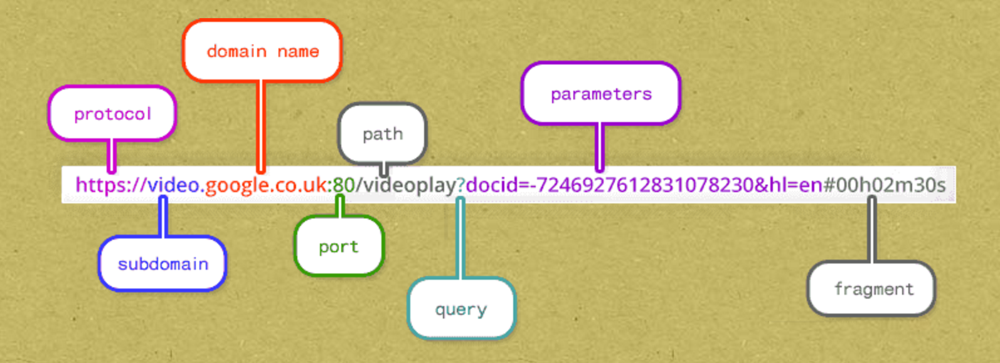

# Pasando valores

## Envío de formulario

Podemos pasar valores del cliente al servidor a través de la URL o del cuerpo de la solicitud.

Cuando se envía un formulario, usando el método "POST" o "GET". El método "POST" hace el envío del formulario a través del cuerpo de la solicitud. El método "GET" para el envío de un formulario envía los valores de envío del formulario a través de la URL.

Recordar esto así:

```
post - > body

get - > url
```

**Post** tiene cuatro letras y también **form**.

**Get** tiene tres letras y también **url**.

|:V

***

## Valores de URL

Siempre se puede agregar valores a una URL.

Cualquier cosa después del ```?``` es la cadena de consulta - el área donde se almacenan los valores temporalmente.



Los valores se almacenan en un ```identificador=valor``` normalmente.

Puedes tener multiples ```identificador=valor``` separándolos con el ```&``` ampersand.

***

## Recuperando valores

Si bien hay varias formas de recuperar valores, se preferira:

[func (*Request) FormValue](https://godoc.org/net/http#Request.FormValue)
``` Go
func (r *Request) FormValue(key string) string
```
FormValue devuelve el primer valor para el componente con nombre del query. Los parámetros de cuerpo POST y PUT tienen prioridad sobre los valores en la cadena de consulta de la URL. FormValue llama a ParseMultipartForm y ParseForm si es necesario e ignora cualquier error devuelto por estas funciones. Si la clave no está presente, FormValue devuelve la cadena vacía. Para acceder a múltiples valores de la misma clave, se llama a ParseForm y luego se inspecciona Request.Form directamente.